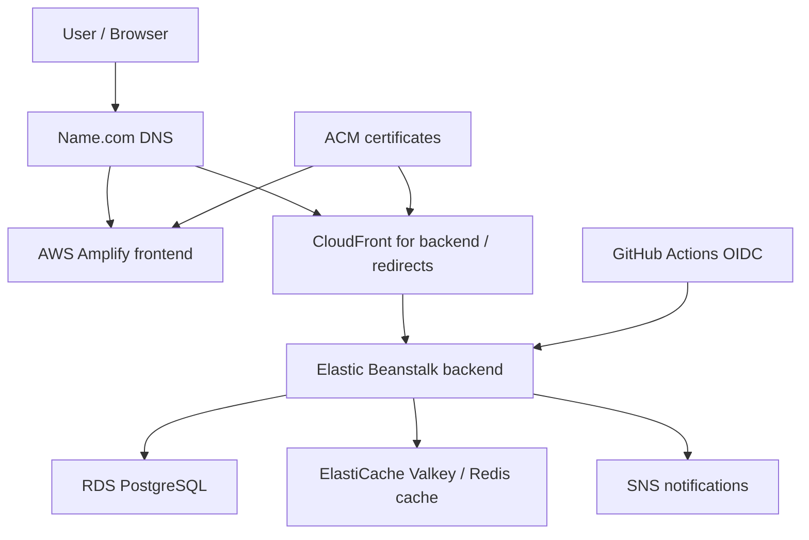

# AWS Infrastructure Guide

Last reviewed: 2026-05-25

This document is the rebuild and migration runbook for Razorlinks on AWS. It explains the current architecture, the infrastructure pieces that must exist in a new AWS account, and the order to recreate them safely.

Do not store secret values in this file. Store only variable names, resource names, and setup notes.

## Current Architecture

Razorlinks uses a custom AWS environment rather than the default VPC.



Current known details:

| Area | Current value |
| --- | --- |
| Primary AWS Region | `ap-south-1` / Asia Pacific Mumbai |
| Backend hosting | Elastic Beanstalk |
| Backend application | `Razorlinks-sb` |
| Backend environment | `Razorlinks-sb-env-1` |
| Frontend hosting | AWS Amplify |
| Database | RDS PostgreSQL |
| Cache | ElastiCache Valkey / Redis-compatible cache |
| CDN / edge | CloudFront |
| Certificates | ACM, validated from Name.com DNS |
| CI/CD | GitHub Actions with AWS OIDC |
| Notifications | SNS |
| Domain registrar / DNS | Name.com |
| Main domain | `razorlinks.dev` |

## Target Account Migration Goal

The new AWS account should reproduce the same logical environment:

- Custom VPC with public and private subnets.
- RDS PostgreSQL in private subnets.
- ElastiCache Valkey in private subnets.
- Elastic Beanstalk backend with environment variables configured manually or by IaC.
- Amplify frontend connected to the GitHub repository.
- CloudFront and ACM for public HTTPS.
- GitHub Actions OIDC role in the new AWS account.
- SNS topic and subscriptions for operational notifications.
- Name.com DNS records updated only after the new stack is verified.

## Region And Certificate Rules

Use `ap-south-1` for regional resources unless deliberately changing regions:

- Elastic Beanstalk
- RDS
- ElastiCache
- SNS
- VPC, subnets, route tables, and security groups

ACM certificate placement depends on the AWS service:

- CloudFront viewer certificates must be in `us-east-1`.
- Elastic Beanstalk or regional load balancer certificates must be in the same region as the environment, currently `ap-south-1`.
- Amplify custom domain certificates are usually managed by Amplify, but DNS validation still happens through Name.com.

For external DNS providers like Name.com, ACM gives DNS validation CNAME records. Add those CNAME records in Name.com and leave them in place so ACM can renew certificates automatically.

## VPC Layout

Use a custom VPC, not the default VPC.

Suggested low-cost layout:

| Component | Recommendation |
| --- | --- |
| VPC CIDR | `10.0.0.0/16` or another non-overlapping private range |
| Public subnet | At least 1 public subnet for public load balancer resources |
| Private data subnet | At least 1 private subnet for RDS and ElastiCache |
| NAT Gateway | Avoid for low-cost setup if not required |
| Internet Gateway | Required for public subnets |

Suggested production layout:

| Component | Recommendation |
| --- | --- |
| Public subnets | 2 subnets across 2 AZs |
| Private app subnets | 2 subnets across 2 AZs for Elastic Beanstalk instances |
| Private data subnets | 2 subnets across 2 AZs for RDS and ElastiCache subnet groups |
| NAT Gateway | 1 for cost-conscious production, 2 for higher availability |
| Route tables | Separate public, private app, and private data route tables |

Current route table layout:

| Route table | Associated subnets | Routes |
| --- | --- | --- |
| `razorlinks-pub-rt` | Public subnets | Local VPC route plus `0.0.0.0/0` to the Internet Gateway |
| `razorlinks-priv-rt` | Private subnets | Local VPC route only |

Current placement:

| Resource tier | Current subnet placement | Route table |
| --- | --- | --- |
| Elastic Beanstalk backend | `razorlinks-pub-sub-01` public subnet | `razorlinks-pub-rt` |
| RDS PostgreSQL | Private subnet group | `razorlinks-priv-rt` |
| ElastiCache Valkey | Private subnet group | `razorlinks-priv-rt` |

This is the current low-cost layout: the app tier sits in a public subnet so it can reach the internet without NAT, while stateful data services stay in private subnets. If Elastic Beanstalk instances are moved to private subnets later, add a NAT Gateway route to the private app route table for outbound SMTP/OAuth/HTTPS access.

Important note: the backend sends email and uses OAuth providers. If Elastic Beanstalk instances are in private subnets, they need outbound internet access through NAT or another planned path for:

- SMTP to the configured mail provider.
- HTTPS to OAuth providers and external APIs.
- Package or OS-level calls made by the platform.

If outbound access is intentionally restricted, explicitly allow only the required destinations and ports.

## Subnet Groups

Create subnet groups before creating RDS and ElastiCache.

RDS subnet group:

- Use private subnets only.
- For low-cost, one private subnet can work.
- For production, use at least two private subnets in different AZs.

ElastiCache subnet group:

- Use private subnets only.
- The current low-cost setup can use the same private subnet where RDS exists.
- With `0` replicas, one AZ is acceptable.
- With replicas, use multiple AZs so the replica actually improves availability.

## Security Groups

Prefer security group references instead of IP ranges inside the VPC.

Suggested security groups:

| Security group | Purpose |
| --- | --- |
| `razorlinks-alb-sg` | Public load balancer or Elastic Beanstalk load balancer |
| `razorlinks-eb-sg` | Elastic Beanstalk EC2/application instances |
| `razorlinks-rds-sg` | RDS PostgreSQL |
| `razorlinks-redis-sg` | ElastiCache Valkey |

Current security group inventory exported on 2026-05-24:

| Security group | Current ID | Purpose | Notes for migration |
| --- | --- | --- | --- |
| `awseb-e-s522ptkpig-stack-AWSEBSecurityGroup-lKLBxf7o1v1M` | `sg-010ddf38af38c56e2` | Elastic Beanstalk generated security group | Account/environment-specific. Recreate through EB, do not hard-code. Export shows inbound `80` and `22` from anywhere and outbound all traffic. Restrict SSH or remove it if not needed. |
| `razorlinks-eb-sg` | `sg-0404302b330e73808` | Custom Elastic Beanstalk app security group | Recreate by name/purpose in the new account. Export shows inbound `80`/`443` from anywhere, outbound `5432` to RDS SG, and outbound `6379` to Redis SG. |
| `razorlinks-rds-sg` | `sg-0fbeb8f3eec705087` | RDS PostgreSQL security group | Recreate by name/purpose. Export shows inbound `5432` only from `razorlinks-eb-sg`, with no outbound rules. |
| `razorlinks-redis-sg` | `sg-0980b6f1fe8caf2df` | ElastiCache Valkey security group | Recreate by name/purpose. Export shows inbound `6379` only from `razorlinks-eb-sg`. Outbound all is present but not required for return traffic because security groups are stateful. |
| `default` | `sg-0c6e3385d29cb8570` | Default VPC security group | Do not rely on this for Razorlinks workloads. |

Target rules to recreate:

| Security group | Direction | Port | Source / destination | Notes |
| --- | --- | --- | --- | --- |
| `razorlinks-alb-sg` | Inbound | 80 / 443 | Internet or CloudFront origin-facing prefix list | Depends on whether CloudFront is mandatory in front of backend |
| `razorlinks-alb-sg` | Outbound | backend app port | `razorlinks-eb-sg` | Needed for load-balanced EB |
| `razorlinks-eb-sg` | Inbound | backend app port | `razorlinks-alb-sg` | Use the actual EB instance listener port |
| `razorlinks-eb-sg` | Outbound | 5432 | `razorlinks-rds-sg` | Required for PostgreSQL |
| `razorlinks-rds-sg` | Inbound | 5432 | `razorlinks-eb-sg` | RDS should not be public |
| `razorlinks-eb-sg` | Outbound | 6379 | `razorlinks-redis-sg` | Required when EB egress is restricted |
| `razorlinks-redis-sg` | Inbound | 6379 | `razorlinks-eb-sg` | ElastiCache should not be public |
| `razorlinks-eb-sg` | Outbound | 443 | Internet / NAT | Required for OAuth/external HTTPS if no wider egress exists |
| `razorlinks-eb-sg` | Outbound | 587 | Internet / NAT | Required for Gmail SMTP if using current mail config |

Security groups are stateful, so return traffic is automatically allowed for accepted connections. If `razorlinks-eb-sg` has only a PostgreSQL outbound rule, add a second outbound rule for Redis on TCP `6379`.

## RDS PostgreSQL

Current purpose:

- Source of truth for users, URL mappings, clicks, audit logs, tokens, and other persistent data.

Current RDS configuration:

| Setting | Current value |
| --- | --- |
| DB instance ID | `razorlinks-db` |
| Engine | PostgreSQL |
| Engine version | `17.4` |
| RDS Extended Support | Disabled |
| DB name | Not set |
| Master username | `postgres` |
| IAM DB authentication | Not enabled |
| Instance class | `db.t4g.micro` |
| vCPU / RAM | 2 vCPU / 1 GB RAM |
| Multi-AZ | No |
| Storage type | General Purpose SSD `gp2` |
| Allocated storage | 20 GiB |
| Storage autoscaling | Enabled |
| Maximum storage threshold | 1000 GiB |
| Encryption | Enabled |
| KMS key | AWS managed key `aws/rds` |
| Parameter group | `default.postgres17` |
| Option group | `default:postgres-17` |
| Deletion protection | Disabled |
| Performance Insights | Enabled, 7 day retention |
| Database Insights | Standard |
| Enhanced Monitoring | Disabled |
| Security group | `razorlinks-rds-sg` |

Recommended low-cost setup:

- Engine: PostgreSQL.
- Public access: disabled.
- Instance class: smallest suitable `db.t4g` or free-tier-compatible class available in the account.
- Storage: gp3 or default low-cost storage.
- Multi-AZ: disabled.
- Backups: enabled with short retention if budget allows.
- Encryption: enabled.
- Security group: `razorlinks-rds-sg`.

Recommended production setup:

- Multi-AZ enabled.
- Automated backups with a retention period appropriate for recovery needs.
- Performance Insights and alarms if budget allows.
- Customer managed KMS key if cross-account snapshot sharing is expected.

Migration options:

1. For small databases, use `pg_dump` from the old RDS and `pg_restore` into the new RDS. This is simple and avoids cross-account KMS complications.
2. For larger databases, use a manual RDS snapshot. If the snapshot is encrypted with the default AWS managed KMS key, it cannot be shared cross-account directly. Copy it using a customer managed KMS key that the target account can access, then share/copy it into the new account.

## ElastiCache Valkey / Redis

Current purpose:

- Cache short URL redirect lookups.
- RDS remains the source of truth.
- Cache loss should not break the app; it only causes cache misses and DB lookup fallback.

Current low-cost shape:

- Engine: Valkey.
- Cluster mode: disabled.
- Node type: `cache.t4g.micro`.
- Replicas: `0`.
- Subnet group: private subnet group.
- Security group: `razorlinks-redis-sg`.
- Encryption at rest: enabled.
- Encryption in transit: enabled and required.
- Access control: AUTH default user access.
- Backups: disabled.

Elastic Beanstalk must use:

```text
REDIS_HOST=<primary-endpoint-without-port>
REDIS_PORT=6379
REDIS_SSL_ENABLED=true
REDIS_PASSWORD=<auth-token>
REDIS_USERNAME=
```

Use `REDIS_USERNAME` only if a named ACL user is configured. With default AUTH user access, a password is usually enough.

## Elastic Beanstalk Backend

Current deployment:

- GitHub Actions builds the Gradle backend under `razorlinks/`.
- The workflow deploys `razorlinks/build/libs/razorlinks-0.0.1-SNAPSHOT.jar`.
- Current app name: `Razorlinks-sb`.
- Current environment name: `Razorlinks-sb-env-1`.
- Current region: `ap-south-1`.

Create or configure:

- Elastic Beanstalk application.
- Java 21 compatible platform.
- Environment in the custom VPC.
- Instance profile for EC2 instances.
- Service role for Elastic Beanstalk.
- Security group access to RDS and ElastiCache.
- Runtime environment variables.
- Optional SNS notification topic for environment health.

Backend environment variables:

```text
DATABASE_URL=
DATABASE_USERNAME=
DATABASE_PASSWORD=
DATABASE_DIALECT=

JWT_SECRET=
JWT_EXPIRATION=

FRONTEND_URL=
SUBDOMAIN_URL=

EMAIL_ADDRESS=
APP_PASSWORD=
EMAIL_PASSWORD=

GITHUB_CLIENT_ID=
GITHUB_CLIENT_SECRET=
GOOGLE_CLIENT_ID=
GOOGLE_CLIENT_SECRET=

SERVER_PORT=
SPRING_PROFILE=prod

REDIS_HOST=
REDIS_PORT=6379
REDIS_SSL_ENABLED=true
REDIS_TIMEOUT=2s
REDIS_USERNAME=
REDIS_PASSWORD=

RATE_LIMIT_AUTH_CAPACITY=
RATE_LIMIT_AUTH_REFILL_TOKENS=
RATE_LIMIT_AUTH_REFILL_DURATION=
RATE_LIMIT_REDIRECT_CAPACITY=
RATE_LIMIT_REDIRECT_REFILL_TOKENS=
RATE_LIMIT_REDIRECT_REFILL_DURATION=
RATE_LIMIT_AUTHENTICATED_CAPACITY=
RATE_LIMIT_AUTHENTICATED_REFILL_TOKENS=
RATE_LIMIT_AUTHENTICATED_REFILL_DURATION=
```

Current Elastic Beanstalk free-tier environment variable names:

```text
APP_PASSWORD
DATABASE_DIALECT
DATABASE_PASSWORD
DATABASE_URL
DATABASE_USERNAME
EMAIL_ADDRESS
EMAIL_PASSWORD
FRONTEND_URL
GITHUB_CLIENT_ID
GITHUB_CLIENT_SECRET
GOOGLE_CLIENT_ID
GOOGLE_CLIENT_SECRET
GRADLE_HOME
JAVA_TOOL_OPTIONS
JWT_EXPIRATION
JWT_SECRET
M2
M2_HOME
REDIS_HOST
REDIS_PASSWORD
REDIS_PORT
REDIS_SSL_ENABLED
REDIS_TIMEOUT
SERVER_PORT
SPRING_PROFILE
SUBDOMAIN_URL
```

Current non-secret values worth preserving:

```text
DATABASE_DIALECT=org.hibernate.dialect.PostgreSQLDialect
DATABASE_USERNAME=postgres
FRONTEND_URL=https://razorlinks.dev
JWT_EXPIRATION=86400000
REDIS_PORT=6379
REDIS_SSL_ENABLED=true
REDIS_TIMEOUT=2000
SERVER_PORT=5000
SPRING_PROFILE=prod
SUBDOMAIN_URL=https://url.razorlinks.dev
JAVA_TOOL_OPTIONS=-Xmx512m -Xms128m -XX:MaxMetaspaceSize=128m -XX:+UseG1GC -XX:MaxGCPauseMillis=200
```

Do not commit actual values for passwords, app passwords, OAuth client secrets, JWT secrets, database URLs, or Redis auth tokens. Also note that the application currently derives admin credentials from `EMAIL_ADDRESS` and `EMAIL_PASSWORD` in `application.properties`; there are no separate `ADMIN_EMAIL` or `ADMIN_PASSWORD` variables in the current EB environment.

The application currently reads these from `razorlinks/src/main/resources/application.properties`.

## Amplify Frontend

Current purpose:

- Hosts the React/Vite frontend.
- Connected to GitHub for frontend CI/CD.

Create or configure:

- Amplify app connected to the repository.
- Build command: `npm run build`.
- Output directory: usually `dist` for Vite.
- Custom domain for the frontend.
- Redirect/rewrite rules for SPA routing.

Current Amplify build spec:

```yaml
version: 1
frontend:
  phases:
    preBuild:
      commands:
        - cd razorlinks-web
        - npm install
    build:
      commands:
        - npm run build
  artifacts:
    baseDirectory: razorlinks-web/dist
    files:
      - "**/*"
  cache:
    paths:
      - node_modules/**/*
```

Frontend environment variables:

```text
VITE_BACKEND_URL=
VITE_REACT_SUBDOMAIN=
```

`VITE_BACKEND_URL` should point to the backend base URL without `/api`, because the frontend app appends `/api` in `razorlinks-web/src/services/api.js`.

`VITE_REACT_SUBDOMAIN` should point to the public short-link domain used to render/copy short URLs.

## CloudFront

Current purpose:

- Provides a public HTTPS edge endpoint for backend and redirect traffic.
- Can reduce global latency and hide the raw Elastic Beanstalk endpoint.

Current CloudFront distribution:

| Setting | Current value |
| --- | --- |
| Name | `Razorlinks-dist` |
| Alternate domain name | `api.razorlinks.dev` |
| Origin or origin group | `razorlinks.ap-south-1.elasticbeanstalk.com-mg9obqncz7o` |
| Price class | All edge locations |
| Supported HTTP versions | HTTP/2, HTTP/1.1, HTTP/1.0 |
| Custom SSL certificate | `razorlinks.dev` certificate |
| Security policy | `TLSv1.2_2021` |
| Standard logging | Off |
| Cookie logging | Off |
| Default root object | Not set |
| Default behavior path pattern | `*` |
| Viewer protocol policy | Redirect HTTP to HTTPS |
| Cache policy | `Managed-CachingDisabled` |
| Origin request policy | `Managed-AllViewer` |
| Response headers policy | Not set |

Create or configure:

- Origin pointing to the Elastic Beanstalk environment or its load balancer.
- Viewer protocol policy: redirect HTTP to HTTPS.
- Cache policy: be careful with API routes that require auth.
- Forward required headers, cookies, and query strings for API/auth flows.
- ACM certificate in `us-east-1` for CloudFront viewer TLS.
- DNS record at Name.com pointing the backend/redirect domain to the CloudFront distribution.

Do not blindly cache authenticated API responses. Redirect responses can be cached only if the app behavior and analytics requirements allow it. The current Redis cache is safer because click tracking remains inside the backend.

## ACM And Name.com DNS

For each needed domain or subdomain:

1. Request an ACM certificate.
2. Choose DNS validation.
3. Copy ACM CNAME validation records.
4. Add the CNAME records in Name.com.
5. Wait for ACM validation.
6. Attach the certificate to CloudFront, Amplify, or the regional load balancer.

Keep the ACM validation CNAME records in Name.com. They are needed for managed renewal.

Certificate checklist:

| Use | Region | Example names |
| --- | --- | --- |
| CloudFront viewer certificate | `us-east-1` | `razorlinks.dev`, `*.razorlinks.dev` |
| Elastic Beanstalk / regional ALB certificate | `ap-south-1` | backend or API domain if terminating TLS regionally |
| Amplify custom domain | Managed by Amplify / ACM | frontend domain records from Amplify |

## SNS Notifications

Create an SNS topic for infrastructure notifications, for example:

```text
razorlinks-alerts
```

Add subscriptions:

- Email subscription for the maintainer.
- Optional additional email or webhook endpoints.

Use SNS for:

- Elastic Beanstalk environment health notifications.
- CloudWatch alarms for RDS CPU, storage, and connections.
- CloudWatch alarms for ElastiCache CPU, memory, and evictions.
- Optional billing alerts through AWS Budgets.

Confirm email subscriptions after creating them, otherwise notifications will not be delivered.

## IAM And GitHub Actions OIDC

Current workflow:

```text
.github/workflows/deploy-backend.yml
```

The workflow currently assumes an AWS role and deploys to Elastic Beanstalk. In a new account:

1. Create an IAM OIDC provider:
   - Provider URL: `https://token.actions.githubusercontent.com`
   - Audience: `sts.amazonaws.com`
2. Create a role for GitHub Actions.
3. Restrict the trust policy to this repository and branch.
4. Attach only the permissions required to build/deploy to Elastic Beanstalk and read/write the deployment package flow used by the action.
5. Update `role-to-assume` in the workflow to the new account role ARN.

Example trust policy skeleton:

```json
{
  "Version": "2012-10-17",
  "Statement": [
    {
      "Effect": "Allow",
      "Principal": {
        "Federated": "arn:aws:iam::<NEW_ACCOUNT_ID>:oidc-provider/token.actions.githubusercontent.com"
      },
      "Action": "sts:AssumeRoleWithWebIdentity",
      "Condition": {
        "StringEquals": {
          "token.actions.githubusercontent.com:aud": "sts.amazonaws.com"
        },
        "StringLike": {
          "token.actions.githubusercontent.com:sub": "repo:Razorquake/Razorlinks:ref:refs/heads/master"
        }
      }
    }
  ]
}
```

Also create or verify:

- Elastic Beanstalk service role.
- Elastic Beanstalk EC2 instance profile.
- Permissions for CloudWatch logs if used.
- Permissions for SNS notifications if the environment publishes to SNS.

Current GitHub Actions deploy role uses a custom IAM policy scoped to the Elastic Beanstalk app, EB storage S3 bucket, related Auto Scaling/EC2 describe calls, CloudFormation stack reads, and EB SNS notification topic access. In a new account, replace:

- `<ACCOUNT_ID>` with the new AWS account ID.
- `Razorlinks-sb` if the Elastic Beanstalk application name changes.
- `ap-south-1` if the region changes.
- `elasticbeanstalk-ap-south-1-<ACCOUNT_ID>` with the new account's Elastic Beanstalk storage bucket name.

Current custom policy template:

```json
{
  "Version": "2012-10-17",
  "Statement": [
    {
      "Sid": "ElasticBeanstalkPermissions",
      "Effect": "Allow",
      "Action": [
        "elasticbeanstalk:CreateApplicationVersion",
        "elasticbeanstalk:DescribeApplicationVersions",
        "elasticbeanstalk:DescribeEnvironments",
        "elasticbeanstalk:DescribeEvents",
        "elasticbeanstalk:UpdateEnvironment",
        "elasticbeanstalk:DescribeEnvironmentHealth",
        "elasticbeanstalk:DescribeInstancesHealth"
      ],
      "Resource": [
        "arn:aws:elasticbeanstalk:ap-south-1:<ACCOUNT_ID>:application/Razorlinks-sb",
        "arn:aws:elasticbeanstalk:ap-south-1:<ACCOUNT_ID>:environment/Razorlinks-sb/*",
        "arn:aws:elasticbeanstalk:ap-south-1:<ACCOUNT_ID>:applicationversion/Razorlinks-sb/*"
      ]
    },
    {
      "Sid": "ElasticBeanstalkStorageLocation",
      "Effect": "Allow",
      "Action": "elasticbeanstalk:CreateStorageLocation",
      "Resource": "*"
    },
    {
      "Sid": "S3BucketPermissions",
      "Effect": "Allow",
      "Action": [
        "s3:CreateBucket",
        "s3:GetBucketLocation",
        "s3:GetBucketPolicy",
        "s3:ListBucket",
        "s3:GetObject",
        "s3:GetObjectAcl",
        "s3:PutObject",
        "s3:PutObjectAcl",
        "s3:DeleteObject"
      ],
      "Resource": [
        "arn:aws:s3:::elasticbeanstalk-ap-south-1-<ACCOUNT_ID>",
        "arn:aws:s3:::elasticbeanstalk-ap-south-1-<ACCOUNT_ID>/*"
      ]
    },
    {
      "Sid": "AutoScalingPermissions",
      "Effect": "Allow",
      "Action": [
        "autoscaling:DescribeAutoScalingGroups",
        "autoscaling:DescribeScalingActivities",
        "autoscaling:SuspendProcesses",
        "autoscaling:ResumeProcesses"
      ],
      "Resource": "*"
    },
    {
      "Sid": "EC2Permissions",
      "Effect": "Allow",
      "Action": [
        "ec2:DescribeInstances",
        "ec2:DescribeInstanceStatus"
      ],
      "Resource": "*"
    },
    {
      "Sid": "CloudFormationPermissions",
      "Effect": "Allow",
      "Action": [
        "cloudformation:DescribeStacks",
        "cloudformation:DescribeStackEvents",
        "cloudformation:DescribeStackResources",
        "cloudformation:DescribeStackResource",
        "cloudformation:GetTemplate"
      ],
      "Resource": "arn:aws:cloudformation:ap-south-1:<ACCOUNT_ID>:stack/awseb-*"
    },
    {
      "Sid": "SNSPermissions",
      "Effect": "Allow",
      "Action": [
        "sns:CreateTopic",
        "sns:GetTopicAttributes",
        "sns:ListSubscriptionsByTopic",
        "sns:Subscribe"
      ],
      "Resource": "arn:aws:sns:ap-south-1:<ACCOUNT_ID>:ElasticBeanstalkNotifications-Environment-*"
    }
  ]
}
```

## Manual Rebuild Checklist

Use this order to avoid circular dependencies.

1. Create the new AWS account and set billing alerts.
2. Select `ap-south-1` as the primary region.
3. Create the custom VPC.
4. Create public and private subnets.
5. Create an Internet Gateway and attach it to the VPC.
6. Create `razorlinks-pub-rt` with local VPC routing plus `0.0.0.0/0` to the Internet Gateway.
7. Associate public subnets with `razorlinks-pub-rt`.
8. Create `razorlinks-priv-rt` with only the local VPC route for the low-cost private data subnet layout.
9. Associate private RDS/ElastiCache subnets with `razorlinks-priv-rt`.
10. Decide whether the app tier needs NAT.
11. Create security groups.
12. Create RDS subnet group.
13. Create RDS PostgreSQL.
14. Create ElastiCache subnet group.
15. Create ElastiCache Valkey.
16. Create SNS topic and subscriptions.
17. Request ACM certificates in `us-east-1` and `ap-south-1` as needed.
18. Add ACM validation CNAME records in Name.com.
19. Create Elastic Beanstalk application and environment.
20. Configure Elastic Beanstalk environment variables.
21. Create GitHub OIDC provider and deployment role.
22. Update `.github/workflows/deploy-backend.yml` with the new role ARN and any new EB names.
23. Deploy backend.
24. Create Amplify frontend app.
25. Configure frontend environment variables.
26. Deploy frontend.
27. Create or update CloudFront distribution for backend/redirect traffic.
28. Add or update Name.com DNS records.
29. Verify app login, registration, email verification, URL shortening, redirects, analytics, QR generation, admin pages, and audit logs.
30. Lower old DNS TTL before final cutover if possible.
31. Cut over DNS.
32. Monitor logs, health, RDS connections, Redis connections, and CloudFront responses.
33. Keep old account resources running until the new account is stable.
34. Delete old resources only after backup/export is verified.

## Data Migration Checklist

Before migration:

- Take a manual RDS snapshot.
- Export a logical backup with `pg_dump` if the database is small enough.
- Record the current DB engine version.
- Record current parameter groups and security group rules.
- Record current Elastic Beanstalk environment variables without secret values.

Migration:

- Restore database into the new RDS instance.
- Update `DATABASE_URL`, `DATABASE_USERNAME`, and `DATABASE_PASSWORD`.
- Do not migrate ElastiCache unless there is a specific reason. Redis cache can start empty.
- Recreate OAuth redirect URLs in Google and GitHub OAuth apps if domains or callback URLs change.
- Recreate SMTP/app passwords if using a different email identity or provider.

After migration:

- Verify user login.
- Verify OAuth login.
- Verify email verification and password reset email.
- Verify short URL creation.
- Verify redirect cache behavior.
- Verify analytics still increment on cached redirect hits.

## Low-Cost vs Production Setup

| Area | Low-cost setup | Production setup |
| --- | --- | --- |
| RDS | Single-AZ, small instance, short backup retention | Multi-AZ, stronger instance, longer backup retention |
| ElastiCache | Single `cache.t4g.micro`, `0` replicas, no backups | Primary plus replica, Multi-AZ, backups if cache data matters |
| App tier | Small EB instance, minimal autoscaling | Load balanced EB with multiple instances |
| NAT | Avoid if app instances can safely be public or do not need private egress | NAT gateway for private app subnets |
| CloudFront | Use for HTTPS and edge routing where useful | Use with tuned cache policies, origin protection, logging |
| Logs | Short retention | Longer retention and alarms |
| SNS | Email notifications | SNS plus alarms and escalation paths |
| IaC | Manual console plus this guide | Terraform, CloudFormation, or CDK |

Cost notes:

- Terraform, CloudFormation, and CDK do not change the cost of the AWS resources themselves.
- CloudFormation has no separate IaC state infrastructure to maintain.
- CDK synthesizes to CloudFormation and is also AWS-native.
- Terraform open-source is free, but remote state commonly uses S3 and DynamoDB, which creates small AWS charges.
- NAT Gateway can become a noticeable monthly cost. Treat it as a deliberate production choice.
- RDS and ElastiCache replicas double the node count for those services.

Recommended path:

1. Keep this manual guide accurate.
2. Rebuild manually once if needed.
3. Convert the stable architecture to IaC.
4. Prefer CloudFormation/CDK for AWS-native lowest operational overhead, or Terraform if multi-cloud portability and broader community modules matter more.

## Post-Migration Verification

Backend:

```text
GET /api/api-docs
POST /api/auth/public/register
POST /api/auth/public/login
GET /{shortLink}
GET /api/urls/myurls
GET /api/urls/totalClicks
```

Frontend:

- Main app loads over HTTPS.
- Auth pages call the new backend.
- Dashboard loads user URLs.
- Short URL copy uses `VITE_REACT_SUBDOMAIN`.
- Redirect subdomain reaches backend redirect endpoint.

Infrastructure:

- Elastic Beanstalk health is green.
- RDS is private and reachable only from EB.
- ElastiCache is private and reachable only from EB.
- CloudFront distribution is deployed.
- ACM certificates are issued.
- Name.com DNS records point to the new AWS resources.
- SNS email subscription is confirmed.
- GitHub Actions deployment succeeds using OIDC.

## Values To Fill During New Account Setup

| Value | New account value |
| --- | --- |
| AWS account ID |  |
| Region | `ap-south-1` |
| VPC ID |  |
| Public route table ID |  |
| Private route table ID |  |
| Internet Gateway ID |  |
| Public subnet IDs |  |
| Private app subnet IDs |  |
| Private data subnet IDs |  |
| Elastic Beanstalk app name |  |
| Elastic Beanstalk environment name |  |
| Elastic Beanstalk EC2 security group |  |
| RDS endpoint |  |
| RDS security group |  |
| ElastiCache primary endpoint |  |
| ElastiCache security group |  |
| CloudFront distribution domain |  |
| Amplify app ID |  |
| SNS topic ARN |  |
| GitHub OIDC role ARN |  |
| ACM certificate ARN for CloudFront |  |
| ACM certificate ARN for regional backend |  |

## References

- AWS Elastic Beanstalk environment variables: https://docs.aws.amazon.com/elasticbeanstalk/latest/dg/environments-cfg-softwaresettings.html
- ACM DNS validation: https://docs.aws.amazon.com/acm/latest/userguide/dns-validation.html
- ElastiCache and compute security group connectivity: https://docs.aws.amazon.com/AmazonElastiCache/latest/dg/compute-connection.html
- VPC security group rules: https://docs.aws.amazon.com/vpc/latest/userguide/security-group-rules.html
- IAM OIDC providers: https://docs.aws.amazon.com/IAM/latest/UserGuide/id_roles_providers_create_oidc.html
- Amplify custom domains: https://docs.aws.amazon.com/amplify/latest/userguide/custom-domains.html
- RDS VPC access scenarios: https://docs.aws.amazon.com/AmazonRDS/latest/UserGuide/USER_VPC.Scenarios.html
- RDS encrypted snapshot sharing: https://docs.aws.amazon.com/AmazonRDS/latest/UserGuide/share-encrypted-snapshot.html
